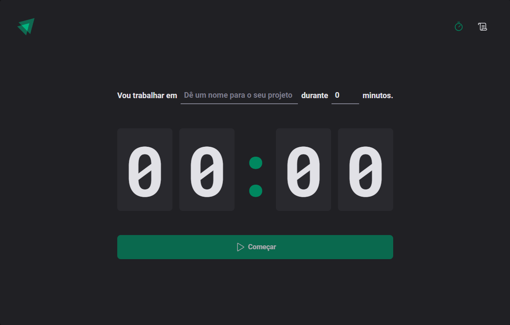

<h1 align="center">Ignite Timer</h1>

On this countdown you can set a task and a duration to keep your focus with a minimum of 5minutes and max 60min.

## [WebSite](https://ignite-time-psi.vercel.app/)

 

I've used this application to improve my knowledge with States, Effects, properties and Typescript. I learned about Context, Reduce and Prop Drilling. Emphasis on Context, that provider data to components.

# Practice and knowledge

- Prop Drilling
- State
- Context
- Reduce
- Effect

# Technologies

- React router dom
- React hook form
- Styled components
- Data fns
- immer
- Zod

You can view layout on figma by clicking [here](https://www.figma.com/community/file/1127351821076435124).
